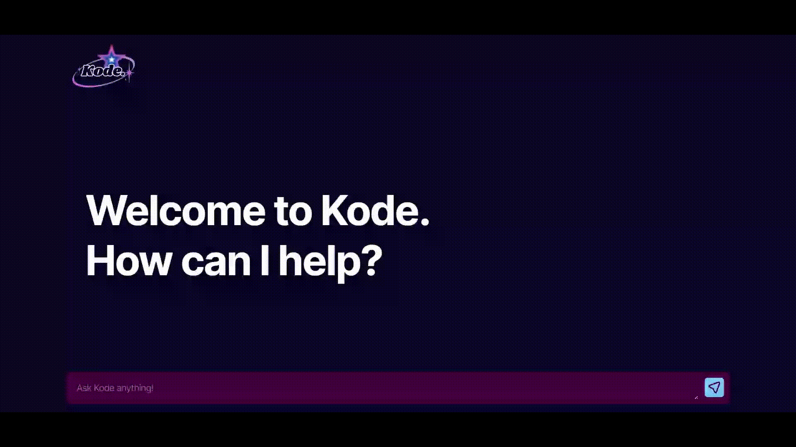

## 🛠️ Tech Stack  

### 🎨 Frontend  
- **HTML5**
- **CSS3**
- **JavaScript (ES6+)**
- **Vite**

### ⚙️ Backend  
- **Node.js** 
- **Express.js** 
- **CORS + dotenv**   

### 🤖 AI Integration  
- **Ollama** – local AI model runner
- **REST API** 

## 🎥 Demo  

  

